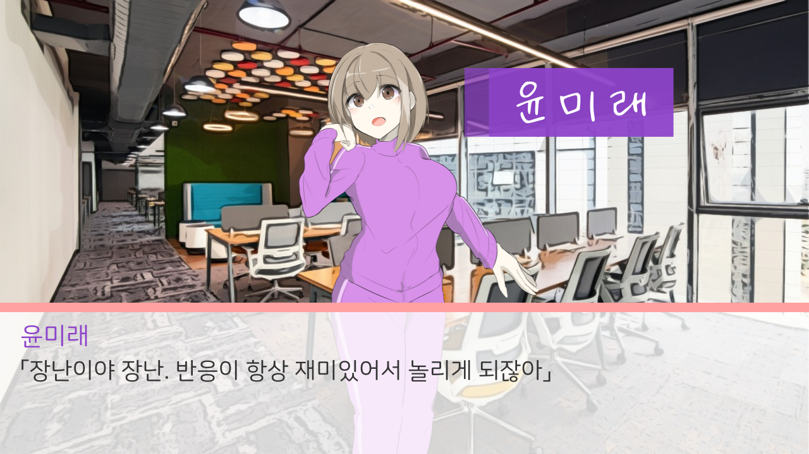
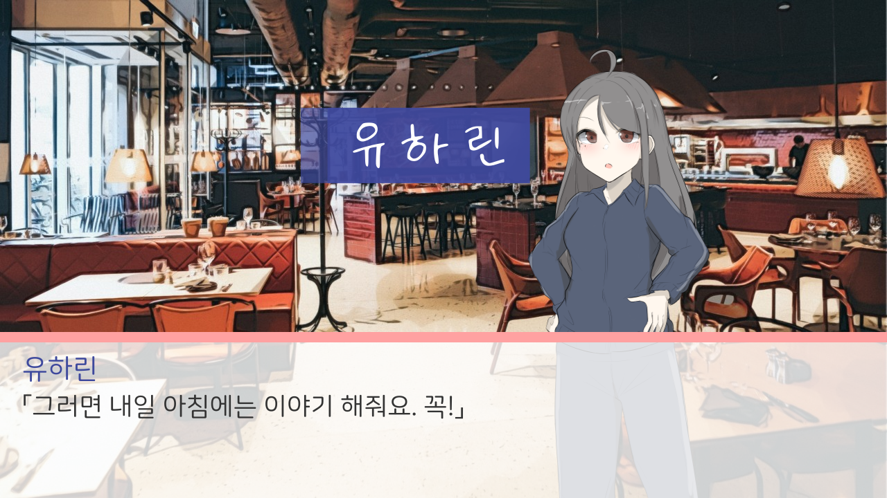

# 언어의 사랑 :: Love of Language


### Team SoleRowCoding
|이름|포지션|
|------|---|
|김학인|개발자|
|공상현|아티스트|
|이원진|매니저|
|이창근|작가|

### 레포지토리 구성
이 레포지토리는 총 4개의 브랜치로 구성됩니다. 개발협업을 위한 브랜치 구분이 아닌, 다른 파일들을 보관하기 위한 목적으로 구성했습니다.
* main : 현재 브랜치. 게임, 레포지토리를 소개하는 대문인 동시에 깃허브페이지로 동작합니다.
* android : android환경에 대응되는 렌파이 프로젝트를 담고있습니다.
* pc : 윈도우즈, 리눅스 환경에 대응되는 렌파이 프로젝트를 담고있습니다. (현재 개발중댠)
* resource : 언어의 사랑에 사용되는 모든 리소스와 출처를 담고있습니다.

### 게임 소개




> 지금 구글PLAY에서 다운로드하기!

https://play.google.com/store/apps/details?id=com.wonj.in.loveoflang


```
갓 전역한 복학생에게 "연애"라는 단어는 꿈에서나 들을 법한 말?
우연에 우연이 겹치면, 이건 필연이야!

허구한 날 놀기만 하던 컴퓨터동아리 '언어의 사랑'.
국방부 퀘스트를 마치고 학교로 돌아왔더니 모범적인 학술 동아리가 되어있었다?

동아리의 변화를 이끌어낸 선배
새로워진 동아리에 합류하는 신입생
나도 모르는 사이 내 일상을 파고드는 두 사람!

지루한 일상에 날아드는 사랑 가득한 일상, 지금 시작합니다.
```
